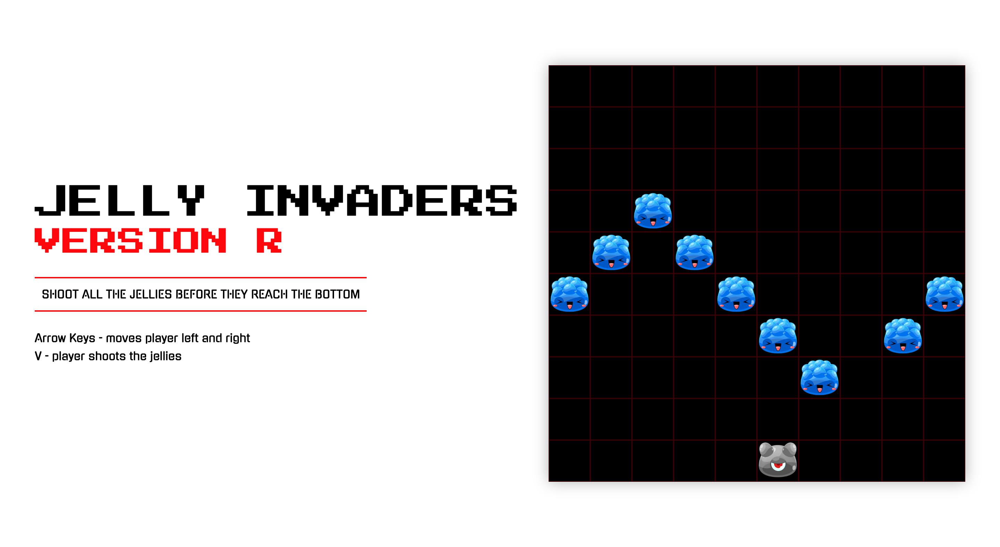
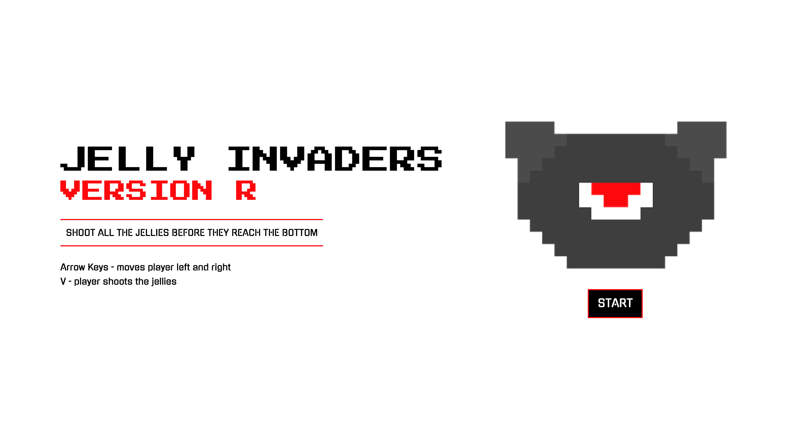
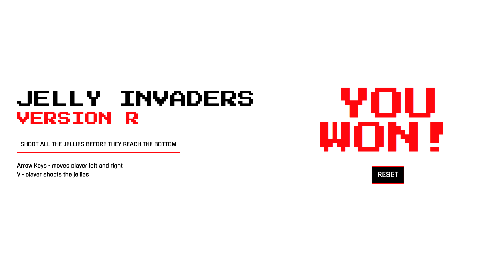
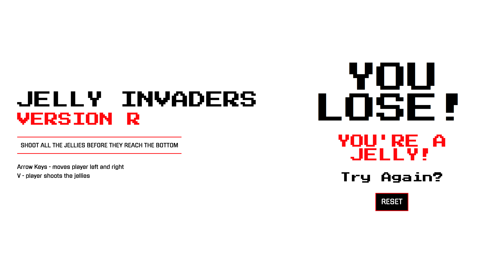

# Jelly Invaders

# Intro
This browser game has been created using a few concepts of the classic Space Invaders.
It is my first project whilst studying at General Assembly in the Software Engineering Immersive. 

## Motivation
Since this is my first project whilst learning to code, I decided to create a game that I would enjoy. I decided to create a game containing some of the basics of Space Invaders, but I wanted to add some of my own ideas too. The pixel art in Space Invaders influenced me want to create a similar game, however I wanted to use a different theme to the classic.

# Table of Contents
- [Deployment](##deployment)
- [Tech Used](##tech-used)
- [Getting Started](##getting-started)
- [Game Architecture](##game-architecture)
  - [Sprites](###sprites)
- [Challenges & Improvements](##challenges-&-improvements)
- [Creator](##creator)

#
## Tech used
* HTML5
* CSS3
* JavaScript

#
## Deployment
The game is deployed on GitHub Pages and it can be found here: https://github.com/missreems/project-01

#
## Getting Started
Download the source code of the game using the clone button on the GitHub page. To play the game, open the index.html file in your browser and click 'Start'.

If any issues arise, check the console. 

#
## Game Architecture

Jelly Invaders is a game where the user moves the player and attempts to shoot all the moving jellies on the 10x10 grid before it reaches the bottom.

The game currently has one wave of jellies.

When the game begins, the computer releases the wave of jellies onto the grid. The jellies move across the grid, when it reaches the end of each line on the grid the jellies will move down to the next line until they reach the second line from the bottom.

The player's sprite is at the bottom of the grid, it is allowed to move left and right via the arrow keys, one cell at a time. The player can shoot the jellies via the 'V' key and releases a bullet only one at a time. The jellies move slighlty slower than the speed of the bullet.

After every bullet is shot by the player, the game checks for a 'win' by verifying if any jellies are left. If the result 'false' is returned from the length of the array of jellies, the player wins. The winning condition checks for the length of the jellies1 array, if there are no jellies in the array then the player wins!

The game can be won by shooting all the jellies on the grid, else the screen will show the sign 'Game Over' if any jelly reaches the red line.

An example of the function...used for ... :

### Sprites
All images used within the game are PNG files and are stored in the assets folder. There are a range of sprites avaiable if you would like to change your player or jellies.

## Challenges & Improvements
The main challenge of this project was creating the game logic for each feature. Each feature introduced in the game allowed me to understand a little bit more about how to piece together code to produce a fully-working feature in the game. Also, connecting features together so they all worked well together was quite challenging.

One of the challenges I faced when building my code was the movement functionality of the jellies. Setting and clearing the interval was a big hurdle for me.

Improvements I would make are refactoring my key functions so the game works smoothly, giving jellies the functionality to shoot and adding an additional condition for losing the game.

## Developer
Reema Patel
